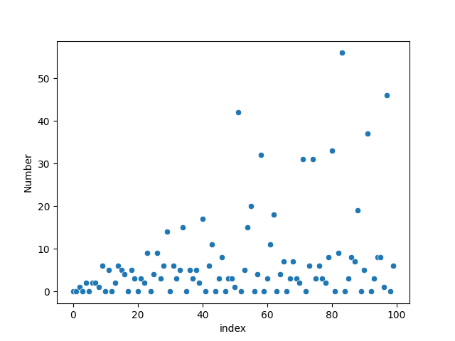
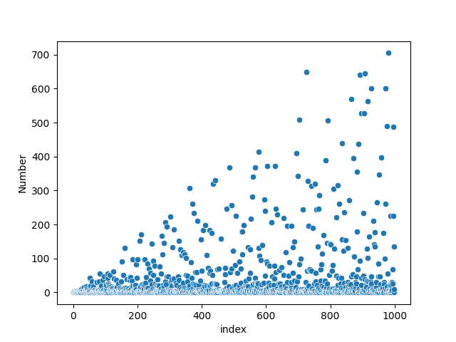
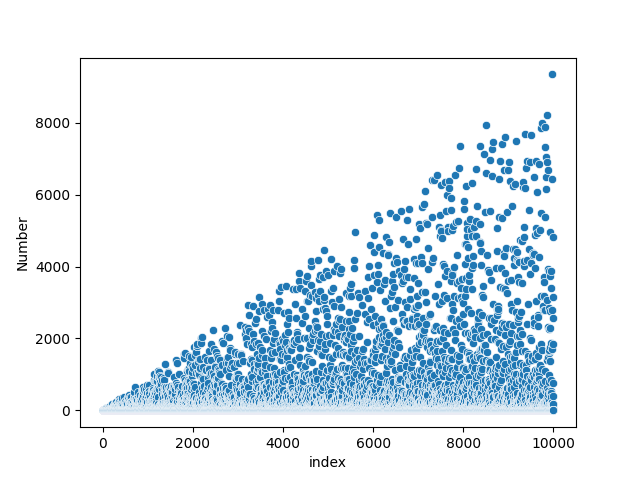
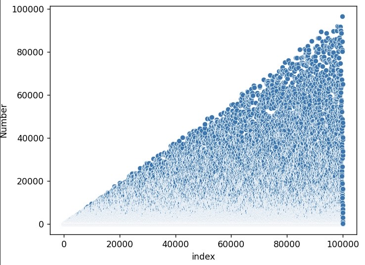
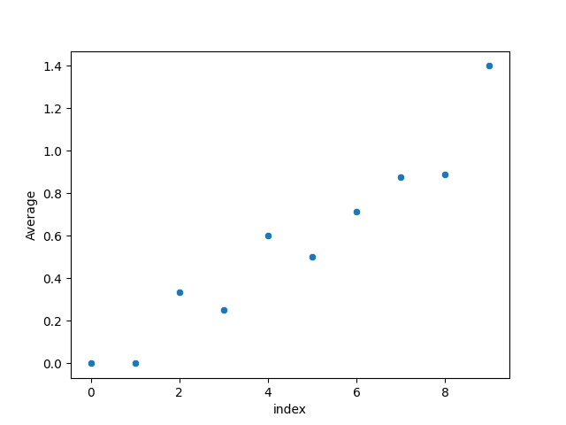
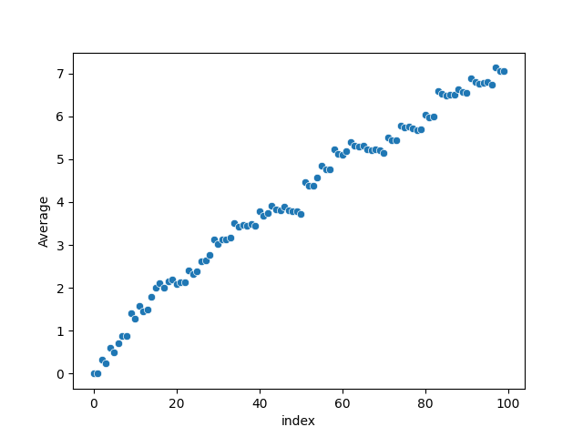
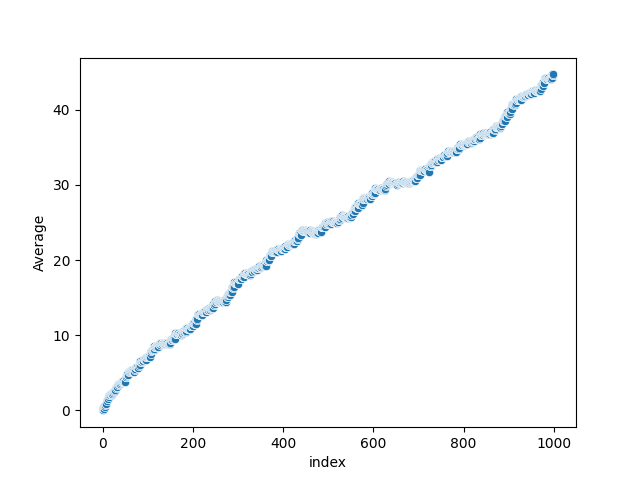
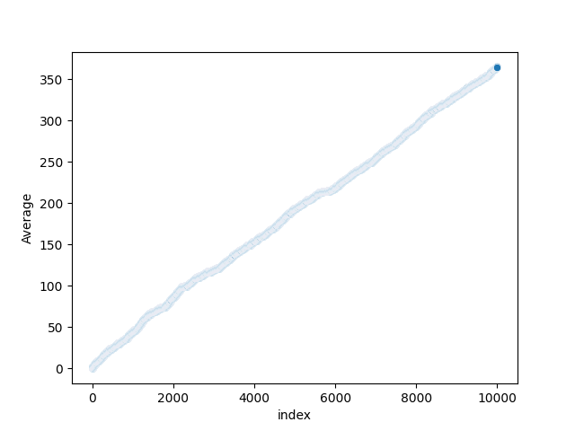
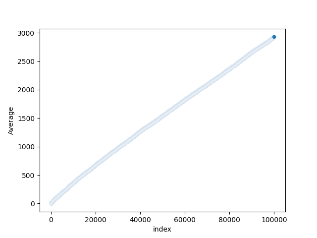

# van-eck-sequence
The script `van_eck_sequence.py` generates the [Van Eck sequence](https://www.youtube.com/watch?v=etMJxB-igrc). 

output: `[0, 0, 1, 0, 2, 0, 2, 2, 1, 6, 0, 5, 0, 2, 6, 5, 4, 0, 5, 3, 0, 3, 2, 9, 0, 4, 9, 3, 6, 14, 0, 6, 3, 5, 15, 0, 5, 3, 5, 2, 17, 0, 6, 11, 0, 3, 8, 0, 3, 3, 1, 42, 0, 5, 15, 20, 0, 4, 32, 0, 3, 11, 18, 0, 4, 7, 0, 3, 7, 3, 2, 31, 0, 6, 31, 3, 6, 3, 2, 8, 33, 0, 9, 56, 0, 3, 8, 7, 19, 0, 5, 37, 0, 3, 8, 8, 1, 46, 0, 6]`

# Seaborn Plots
A scatterplot of the first 100 numbers:

A scatterplot of the first 1,000 numbers:

A scatterplot of the first 10,000 numbers:

A scatterplot of the first 100,000 numbers:

## Plotting the Average as $n \to \infty$
Scatterplot of the first 10 averages:

Scatterplot of the first 100 averages:

Scatterplot of the first 1,000 averages:

Scatterplot of the first 10,000 averages:

Scatterplot of the first 100,000 averages:
